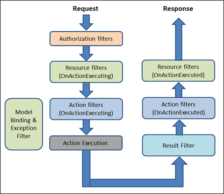

# ASP.NET

## MVC vs Web Form

### MVC > Web Form

* Page plus petite
* Meilleur controle du html
* Plus facilement testable

### Web Form > MVC

* Easier to learn
* Excellent integration with VS
* Same model as WinForms

## MVC

## Can we have generic actions in Web API or MVC?

### Return types of a Controller

* Void – It will return empty content
* HttpResponseMessage – It will convert the response to an HTTP message.
* IHttpActionResult – internally calls ExecuteAsync to create an HttpResponseMessage (IActionResult in aspnet core)
* Other types – You can write the serialized return value into the response body

### What is the biggest disadvantage of “Other Return Types” in Web API?

The biggest disadvantage of this approach is that you cannot directly return an error code like 404 error.

### By default, Web API sends HTTP response with which of the following status code for all uncaught exception?

500 – Internal Server Error

### How can we make sure that Web API returns JSON data only?

```Csharp
Config.Formatters.JsonFormatter.SupportedMediaTypes.Add(new MediaTypeHeaderValue("application/json"));
```

### Filters



#### Authorization filters

The Authorization filters are executed first. This filter helps us to determine whether the user is authorized for the current request. It can short-circuit a pipeline if a user is unauthorized for the current request. We can also create custom authorization filter.

#### Resource filters

The Resource filters handle the request after authorization. It can run the code before and after the rest of the filter is executed. This executes before the model binding happens. It can be used to implement caching.

#### Action filters

The Action filters run the code immediately before and after the controller action method is called. It can be used to perform any action before or after execution of the controller action method. We can also manipulate the arguments passed into an action.

#### Exception filters

The Exception filters are used to handle exception that occurred before anything written to the response body.

#### Result filters

The Result filters are used to run code before or after the execution of controller action results. They are executed only if the controller action method has been executed successfully.

Via attribute or interface implementation (best for DI)  TypeFilterAttribute

## What is an IIS application Pool

## What is the difference between iisreset, recycle, refresh and restart?

### IIS Links

* [Application Pools configuration](https://docs.microsoft.com/en-us/iis/configuration/system.applicationhost/applicationpools/)
* [Application Pools Identities](https://docs.microsoft.com/en-us/iis/manage/configuring-security/application-pool-identities)
* [application Pools](https://docs.microsoft.com/en-us/previous-versions/windows/it-pro/windows-server-2008-R2-and-2008/cc735247(v=ws.10))
